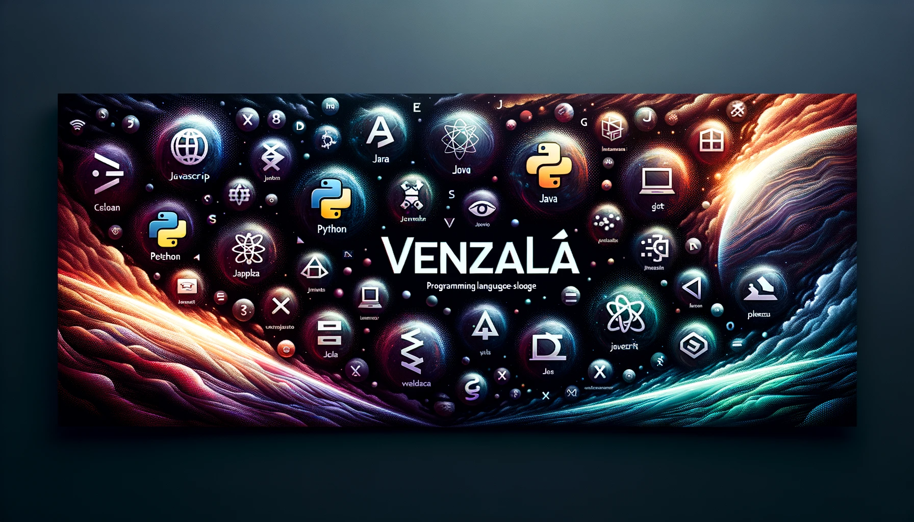

# 🌟 Antonio Venzalá Serrano's GitHub Pages 🌟

## 📚 Índice 📚

- [🎉 Introducción](#introducción)
- [✨ Características](#características)
- [🛠 Tecnologías Utilizadas](#tecnologías-utilizadas)
- [🤝 Cómo Contribuir](#cómo-contribuir)
- [📜 Licencia](#licencia)

## 🎉 Introducción

Bienvenido a mi GitHub Pages 🌐. Aquí encontrarás proyectos personales 👨‍💻, ejemplos de código 📝 y otros recursos útiles 🛠. Espero que lo encuentres interesante!

## ✨ Características

- 📱 Diseño responsivo con Bootstrap
- 📂 Listado dinámico de mis repositorios de GitHub
- 🎯 Contenido organizado y de fácil navegación

## 🛠 Tecnologías Utilizadas

- 🌐 HTML5
- 🎨 CSS3
- 🖥 JavaScript
- [👢 Bootstrap 4.5](https://getbootstrap.com/)
- [💲 jQuery 3.5](https://jquery.com/)

## 🤝 Cómo Contribuir

1️⃣ Clona este repositorio  
2️⃣ Crea una nueva rama  
3️⃣ Realiza tus cambios  
4️⃣ Envía un pull request  

## 📜 Licencia

🔒 Todos los derechos reservados, 2023 Venzalá.
